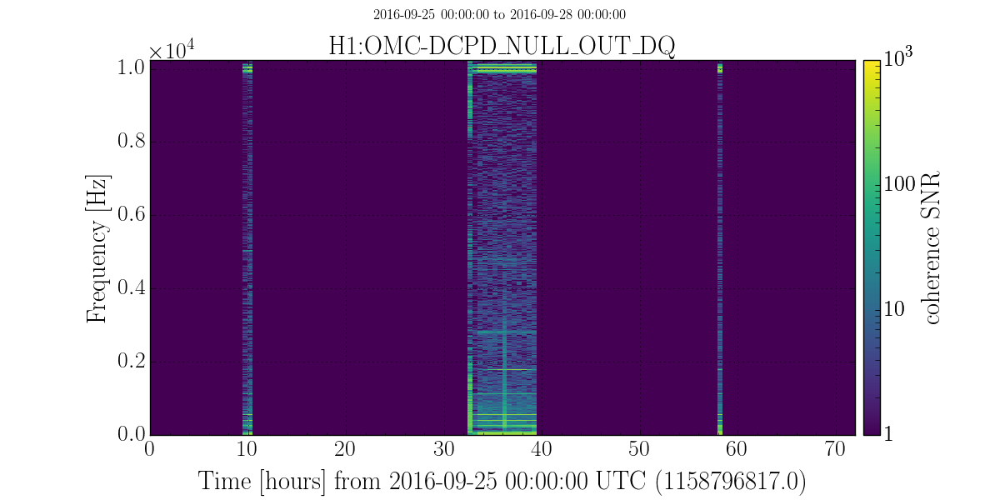
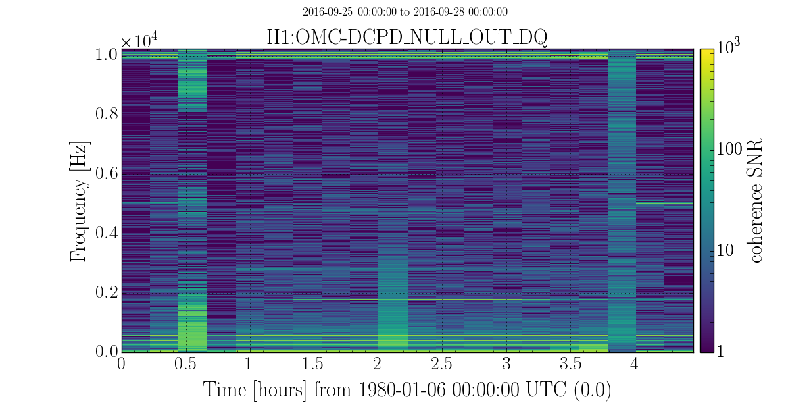

+++++++++++++++++++++++++++++++
Query data from online pipeline
+++++++++++++++++++++++++++++++

Query data from python
----------------------

:py:mod:`stamp_pem.query_online` is the module for querying data. 

We can query data and return :class:`stamp_pem.coherence_segment.PEMCoherenceSegment` list for the requested channel, OR we can have it return a :class:`gwpy.spectrogram.Spectrogram` object. You can currently access this module (and many others) by typing ``source /home/meyers/opt/stamp_pem_soft/bin/activate`` at LHO or LLO. This has the correct paths to the online data hardcoded in so you don't have to worry about it.

>>> from stamp_pem.query_online import get_channel_online_data
>>> data = get_channel_online_data('H1:OMC-DCPD_NULL_OUT_DQ', 'September 25 2016','September 26 2016',format='seglist')
>>> # format default is 'spectrogram'
>>> data_specgram = get_channel_online_data('H1:OMC-DCPD_NULL_OUT_DQ', 'September 25 2016','September 26 2016')

Plot spectrogram for channel between times
------------------------------------------
Include zeros for times when not locked:

``plot_channel_between_times -s 'September 25 2016' -e 'September 28 2016' -c 'H1:OMC-DCPD_NULL_OUT_DQ' -n``

Cut out times that are not locked (x label will be fixed soon):

``plot_channel_between_times -s 'September 25 2016' -e 'September 28 2016' -c 'H1:OMC-DCPD_NULL_OUT_DQ' -n -r``

plot_channel_between_times -h
Usage: plot_channel_between_times [options]

Options:
  -h, --help            show this help message and exit
  -s ST, --start-time=ST
                        start time for combining
  -e ET, --end-time=ET  end time for combining
  -c CHANNEL, --channel=CHANNEL
                        channel
  -r, --remove-nonlocked-times
                        remove nonlocked times from spectrogram
  -n, --normalize-coherence
                        normalize coherence by number of averages
  --flow=FLOW
                        low frequency to plot
  --fhigh=FHIGH
                        high frequency to plot
  --vmin=VMIN
                        min of colorbar
  --vmax=VMAX
                        max of colorbar
  --cmap=CMAP
                        colormap

``query_online`` Module
------------------------

.. automodule:: stamp_pem.query_online
   :members:
