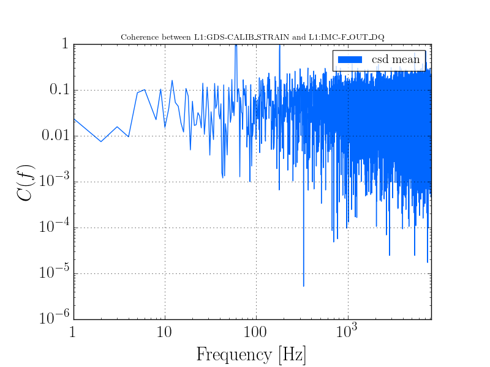

+++++++++++++++++++++
Two Channel Coherence
+++++++++++++++++++++

We want to just run coherence between two channels. This is relatively easily done with the :class:`stamp_pem.coherence_segment.PEMCoherenceSegment`. Below is a code snippet showing how to do this, plot the data, and look at the output. This is taken directly from ``examples/coherence_segment_example.py``

.. literalinclude:: ../../examples/coherence_segment_example.py
   :language: python
   :linenos:

