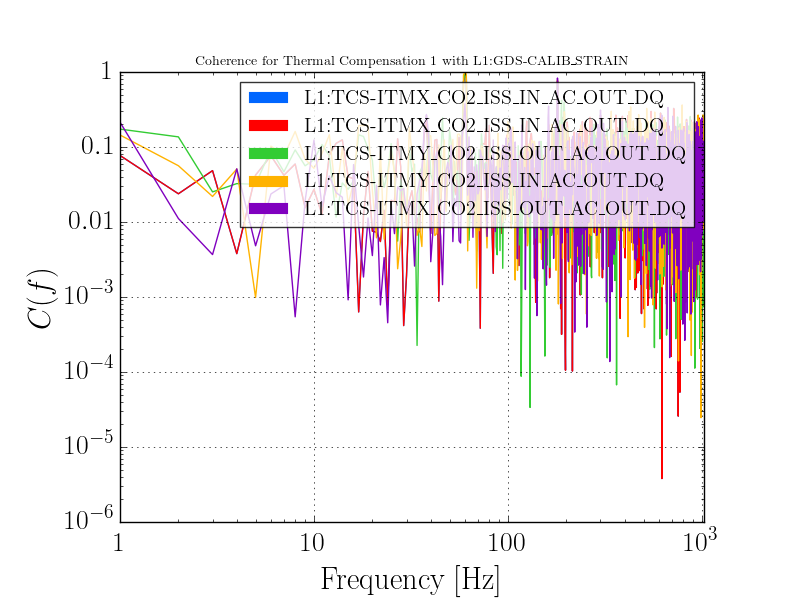
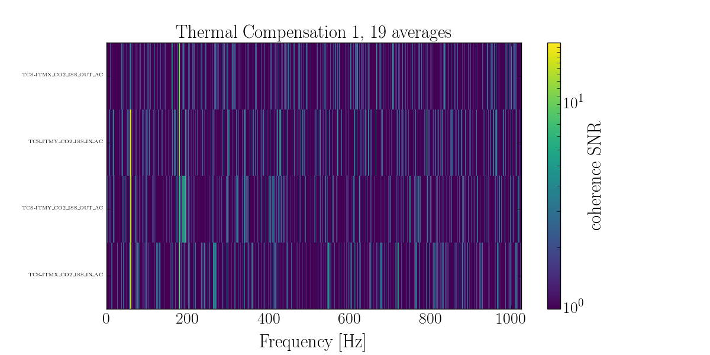

++++++++++++++++++++++++
Coherence with Subsystem
++++++++++++++++++++++++

Now we want to run coherence between one channel and a whole subsystem. The method for this is:

* Read one of the ``ligo-channel-lists`` which can be found here: `<https://git.ligo.org/detchar/ligo-channel-lists>`_
* Pick a subsystem from the list of headers 
* Run :meth:`stamp_pem.coherence_segment.PEMSubsystem.coherence` on that subsystem
* Plot the subsystem

The code below is taken directly from an example you can run in ``examples/subsystem_coherence_example.py``

.. literalinclude:: ../../examples/subsystem_coherence_example.py
   :language: python 
   :linenos:

