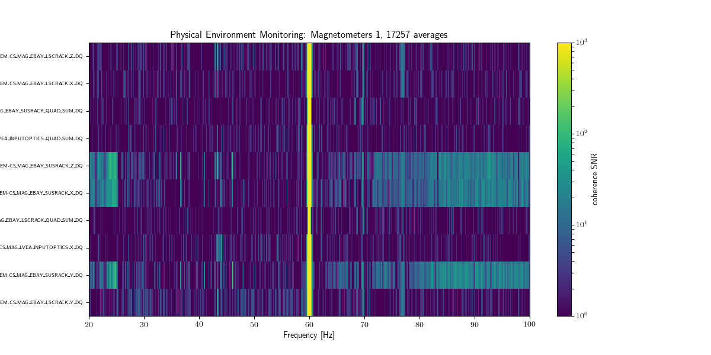
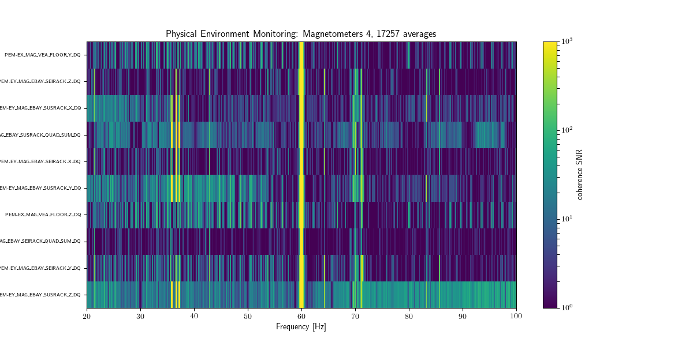

++++++++++++++++++++++++++++++
Selective Query Coherence Data
++++++++++++++++++++++++++++++

If data has already been run in the stamp-pipeline but only the coherence for
manually selected subsystems and gps times (from 1800s to arbitrarily long times)
is desired, then ``selective-query`` can be called. This can be done in one line.
A config file like the one below is needed. The subsystems can be provided from
the command line or be included in the params file. If they are specified from
the command line, then the config file will not be checked. To specify a
subsytem, the entire name need not be specified, rather only a single keyword is
needed. For example, to run all magnetometer channels, use
``--subsystems "Magnetometer"``. Keep in mind not to let the subsystem keyword be
too vague. If ``--subsystem "Mode Cleaner"`` was used then both the input and
output mode cleaners would be run. To include all subsystems in the analysis,
simply use ``--subsystem all``. An example of how this can be run from the command
line is shown below. This example runs over 1800s of data for the all subsystem
at 0.1H resolution and in the frequency band from 20-120Hz. For more
information about ``selective-query`` after this example, visit here_ in the stamp-pem
docs. 

.. code-block:: bash
    :linenos:

    selective-query -i "/home/albert.einstein/config_files/ini_files/H1.ini" -st 1169181018 -et 1169182818 --subsystem all -f 20 120 --new-df 0.1 
    

Select Output
-------------

   H1 coherence between Magnetometer 1 and H1:GDS-CALIB_STRAIN

   H1 coherence between Magnetometer 2 and H1:GDS-CALIB_STRAIN

   H1 coherence between Magnetometer 3 and H1:GDS-CALIB_STRAIN

   H1 coherence between Magnetometer 4 and H1:GDS-CALIB_STRAIN

   H1 coherence between Magnetometer 5 and H1:GDS-CALIB_STRAIN

.. _here: https://ldas-jobs.ligo.caltech.edu/~rich.ormiston/stamp-pem/docs/_build/html/selective_query/selective_query.html
