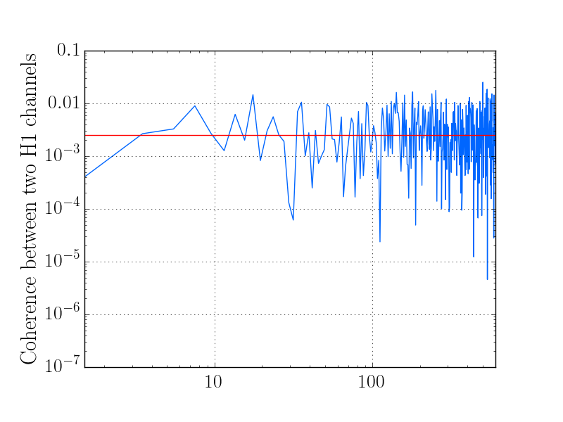

+++++++++++++++++++++++
Coarse Graining Example
+++++++++++++++++++++++

The following are complete examples utilizing various aspects of the stamp-pem
package.

Make and save plots using the :py:meth:`coherence` and :py:meth:`coarse_grain`
methods from :py:class:`coherence_segment.PEMCoherenceSegment`

.. literalinclude:: ../../examples/test_coarsegrain.py
   :linenos:
   :language: python

   H1 coherence between GDS-CALIB_STRAIN and LSC-PRCL_IN1_DQ

   Coarse Grained H1 coherence between GDS-CALIB_STRAIN and LSC-PRCL_IN1_DQ
