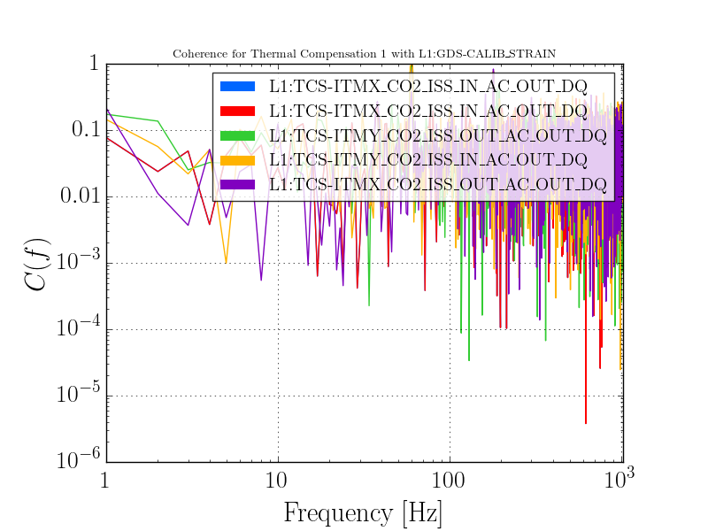
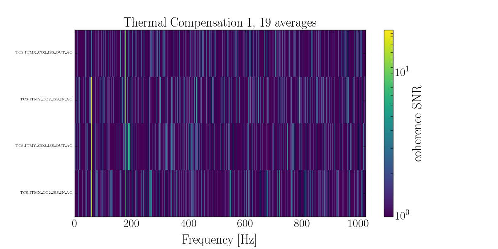

Coherence with Subsystem
========================

Now we want to run coherence between one channel and a whole subsystem. The method for this is:

* Read one of the `ligo-channel-lists` which can be found here_
* Pick a subsystem from the list of headers 
* Run :meth:`stamp_pem.coherence_segment.PEMSubsystem.coherence` on that subsystem
* Plot the subsystem

.. literalinclude:: ../../examples/subsystem_coherence_example.py
   :linenos:

.. _here https://git.ligo.org/detchar/ligo-channel-lists
